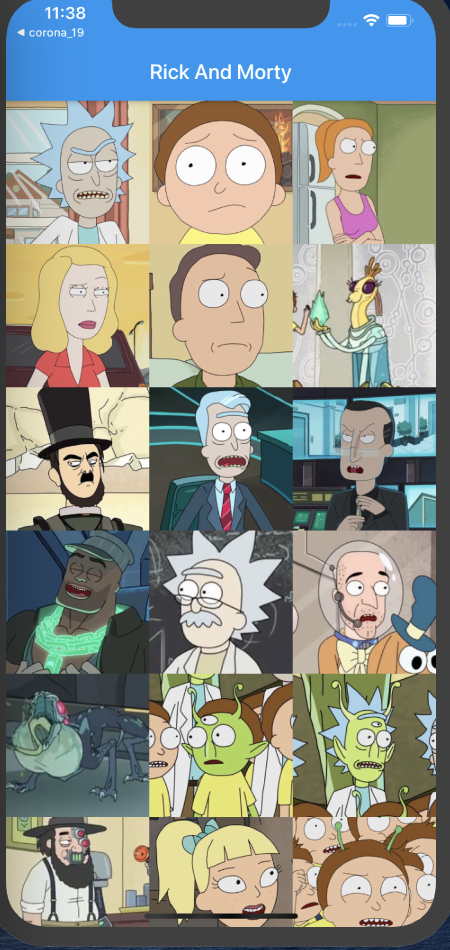
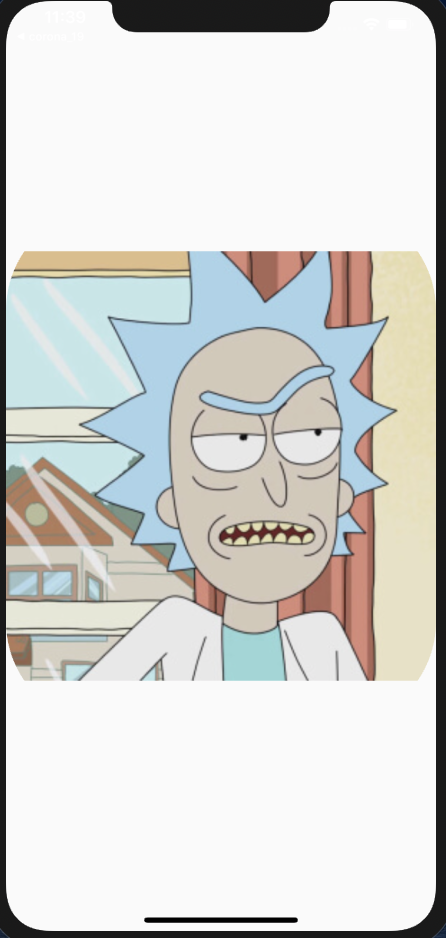

# rickandmorty

A new Flutter project.  
use Hero Widget and GestureDetector Widget and GridView.builder

## ref

- https://api.flutter.dev/index.html
- https://medium.com/@quswlals822/flutter-hero-widget-6805296f790f
